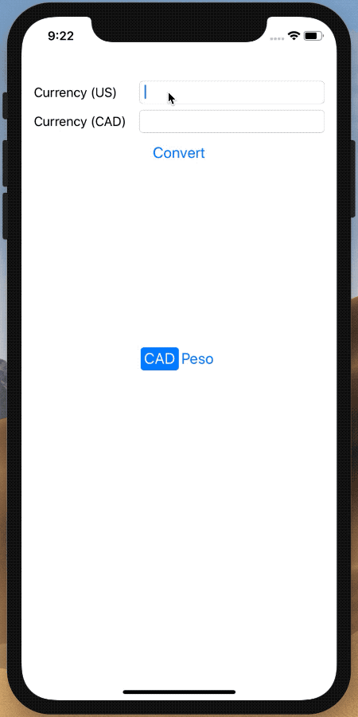

# Swift Fundamentals III Afternoon Project

Create a Currency Convert app that can convert from US dollars (USD) to Canadian dollars (CAD) and Mexican Pesos (MXN).

Get the currency conversion value from Google:

On August 7th, 2019 they were:

	$1 USD to $1.33 CAD
	$1 USD to $19.70 MXN

Currency Converter App



## Add the Conversion Logic

### In `ViewController.swift`:

1. Create a currency type enum above the class and below the `import` statements.

	```swift
	enum Currency {
	    case cad
	    case mxn
	}
	```

2. Create a property named `currency` of type `Currency`. This will store the current currency type we'll be converting to. Set an initial value of `.cad`.
3. In the `cadButtonTapped` action:
    * Toggle this button's `isSelected` state
    * Toggle the mxn button's `isSelected` state
    * Check this button's state, and if `true`:
        * set the `currency` property to `.cad`
        * Display the currency in the `toCurrencyLabel` (so have it say "Currency (CAD)")
4. In the `mxnButtonTapped` action:
    * Toggle this button's `isSelected` state
    * Toggle the cad button's `isSelected` state
    * Check this button's state, and if `true`:
       * set the `currency` property to `.mxn`
       * Display the currency in the `toCurrencyLabel` (so have it say "Currency (MXN)")
5. Create a helper method to calculate the currency based on the Currency using the method signature:
	```swift
	func convert(_ dollars: Double) -> Double {
	}
	```
6. In the above method:
    * Check the value of `currency` to see whether you should convert to CAD or MXN
    * Perform the conversion with the dollars passed into this method
    * Return the converted value
7. In the `convertButtonTapped()` action method:
    * use a `guard let` to get user input
    * convert the dollar amount to the expected currency (hint, you'll want to call the `convert` method you created in step 5)
    * Update the `toCurrencyTextField.text` property with the converted currency value

## Go Further (Optional)

1. Customize the output display using a `NumberFormatter`

	```swift
	var currencyFormatter: NumberFormatter = {
	    let formatter = NumberFormatter()
	    formatter.numberStyle = .currency
	    return formatter
	}()
	```

2. Use the `string(from:)` method to convert from a number to a String for display

